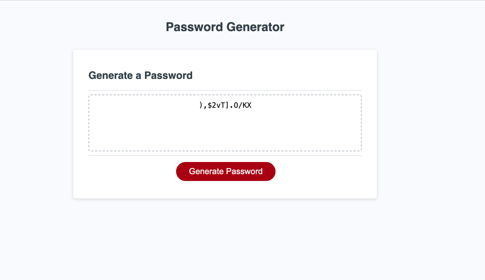
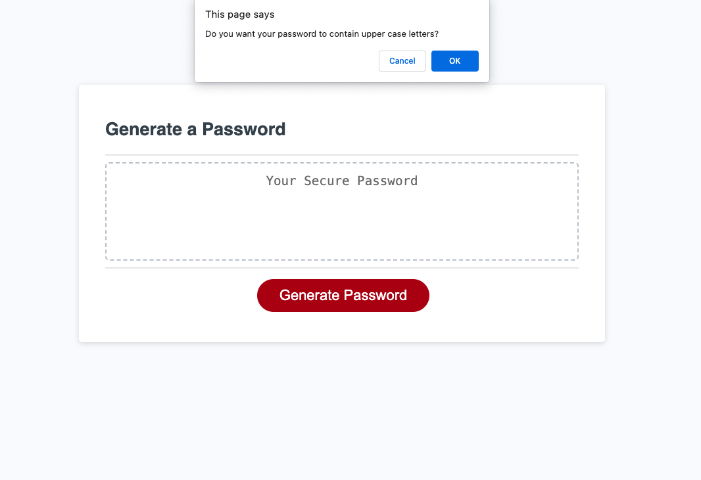

# Liz Builds a Password Generator
  
  ## Description: 
  This project takes user input an runs it through  a  math function to produce a  randomly generated password that meets the user's specs.
  ## Table of Contents: 
  * [installation](#installation)
  * [credits](#credits)
  * [License](#license)

  ## Installation: 
  The deployed project can be opened at https://lizfischstix.github.io/Liz-builds-a-pw-generator/ .  Once on the page, press generate password button and answer the questions that follow.
  
  
  
  
  ## Credits: 
  Built by Liz, with code proofreading help from ChatGPT.

  ## Contact:
  Get in touch on GitHub [@lizfischstix](https://github.com/lizfischstix)
  ## License:
    This project is licensed under the MIT license
